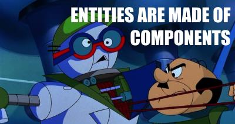

[](https://gitter.im/ECSLight/Lobby?utm_source=badge&utm_medium=badge&utm_campaign=pr-badge&utm_content=badge)
[](https://travis-ci.org/robert-wallis/ECSLight)

# ECS Light

ECS Light is a lightweight Entity Component System ([ECS](https://en.wikipedia.org/wiki/Entity%E2%80%93component%E2%80%93system)).

The main design principles of this library should allow users to:

* Favor Composition over Inheritance
* Seperate Behavior and State
* Easy to Test, and Refactor your code
* Enable Clean-Code such as IoC

To that end, ECS Light does not do any code generation.  We found that
ECS code generators add very little and make developers fear refactoring code.

ECS Light is a portable library so it can be used easily in Unity, MonoGame (XNA), or 
on a headless server.

We try to avoid forcing the user to use a certain paradigm.  Other than the ECS paradigm of course!
For example, Contexts are not in a Singleton, therefore a headless server can run multiple
seperate contexts.  Or two players can play splitscreen with different contexts for each player.
The user is of course free to put a Context into a singleton themself.  (We think
singletons often allow code to violate dependency inversion, making it harder to test.)

We don't claim ECS Light is the prime example of Clean-Code.  Surely it violates some SOLID principles.

Please submit a pull-request if you would like to refactor ECS Light into a cleaner, faster, and lighter, library for everyone.

# Getting Started

## Installing 

1. Download the latest release from [https://github.com/robert-wallis/ECSLight/releases](https://github.com/robert-wallis/ECSLight/releases).
2.
	* **Unity**: Place the `ECSLight.dll` somewhere inside the Assets folder.  I put mine in a `Assets/ECSLight/` folder.
	* **MonoGame**: Just add the `ECSLight.dll` to your References in Visual Studio or Xamarin Studio.

## Quick Start

A context is a helper to manage a set of entities, components, and entity sets.

```csharp
	var context = new Context();
```

Our example context represents anything in our game world.

You can have multiple contexts, like two game boards in a multiplayer game.

### Entities

An **entity** is just id for some thing in your app.

In ECSLight entities are light objects with easy to access APIs for components.

An entity marks an id of a thing.  Like a rock, character, tile, or puzzle piece.


We'll make an entity for a character.

```csharp
	var hero = context.CreateEntity("The Hero");
```

You want to use `Context.CreateEntity` instead of `new`ing up an `Entity` because the component manager
and the set manager need to know when an Entity is destroyed to send the appropriate events and
subscribe entities to the appropriate sets.

### Components



Our 'hero' needs to be placed in the world somewhere, so he needs a position in the world.
Any piece of information, data, about an object is a **component** in ECS.
So let's make a `Position` component.

```csharp
class Position {
	public int X;
	public int Y;
}
```

Notice how `Position` is just a POD, plain-old-datastructure.  And it doesn't contain any logic.
Logic belongs in "Systems" in ECS.


Also the X and Y components are integers, this is because our game world has discrete tile locations.
If you don't care about this, your game should probably use a `Vector2` or `Vector3` or whatever makes
sense.

Now let's add this Position as a component of the hero.

```csharp
	hero.Add(new Position {X = 0, Y = 0});
```

Now the hero is positioned at 0,0.  What does that mean?

* The screen needs to know the position so it can draw the hero.
* To move the hero we need to know the position.
* Collision detection needs to know about position changes to see if he triggered a switch.

Those three examples of logic should be seperated from each-other,
and they shouldn't be in the Position class.  So where do they go?

### Systems


Seperating behavior from information helps organize code.
In object-oriented programming we are taught to put data in *member variables*, and logic in *functions*.
In ECS we put data in *components* and logic in *systems*.
This helps us *seperate concerns* better while still using OO languages.

ECS Light contains no System specific code, because ECS Light is lightweight.

But it does contain `EntitySet` which helps build reactive systems.

```csharp
using ECSLight;
class ViewSystem {
	public ViewSystem(Context context) {
		// get an EntitySet who's entities have a Position
		var positions = context.CreateSet(e => e.Contains<Position>());
		// react to an entity who's position has been added or updated
		positions.OnAdded += OnPositionAdded;
	}
	private void OnPositionAdded(IEntity entity, object oldComponent, object newComponent) {
		var pos = newComponent as Position;
		if (pos == null)
			return;
		LoadView(entity);
	}
	private void LoadView(IEntity entity)
	{
		// ... load up art assets for displaying an object in your game engine
	}
}
```

The above code will run `LoadView` anytime *any* entity's position is changed.
 
You'll want load a different image for a thug than the Batman.
But other systems will also want to do different things for thugs and Batman.
How do you tell them apart?  You use the component system API on the entity.

First add some empty tag-like components.

```csharp
class Batman {}
class Thug {}
```

Then check to see if the entity has that component using `Entity.Contains()`

```csharp
private void LoadView(IEntity entity)
{
	if (entity.Contains<Batman>())
		LoadBatmanArt(entity);
	else if (entity.Contains<Thug>())
		LoadThugArt(entity);
}

private void LoadBatmanArt(entity)
{
	// Unity example:
	var position = entity.Get<Position>();
	var prefab = Resources.Load("BatmanPrefab");
	var gameObject = (GameObject) Object.Instantiate(prefab);
	gameObject.transform.position = new Vector3(position.X, position.Y, 0);
	entity.Add(gameObject);
}
```

What if I have a system that needs to act on all entities that have a set of components?  Like gravity?
```csharp
class Movable{}
```

We'll create an `EntitySet` that is automatically updated with all entities that match all the conditions, they must be `Movable` and have a `Position` to move.

```csharp
using ECSLight;
class GravitySystem {
	private readonly EntitySet _movable;
	public GravitySystem(Context context) {
		_movable = context.CreateSet(e => {
			// all entities that are 'movable' with a Position
			e.Contains<Movable>() &&
			e.Contains<Position>()
		});
	}

	// Call this every frame.
	public void Update()
	{
		foreach (var entity in _movable)
			Affect(entity);
	}

	private void Affect(IEntity entity) {
		var position = entity.Get<Position>();
		var newPosition = new Position {
			X = position.X,
			Y = position.Y - 1
		};
		position.Add(newPosition);
	}
}
```

Why don't we use `entity.Get<GameObject>()` and update the transform right now?
Because other things could update the position too.
Like pressing 'up' on the keyboard, an explosion, or a grappling hook.
All those things have different 'concerns'.
We want to "seperate concerns".

In the above `ViewSystem.OnPositionAdded` example, every time a position changes, the view is loaded again.
Let's change that code to check for updates.

```csharp
	private void OnPositionAdded(IEntity entity, object oldComponent, object newComponent) {
		var pos = newComponent as Position;
		if (pos == null)
			return;
		// check if it's an Add or an Update
		if (oldComponent == null)
			LoadView(entity);
		else
			UpdateView(entity, pos);
	}
	private void UpdateView(IEntity entity, Position pos) {
		var view = entity.Get<GameObject>();
		view.transform.position = new Vector3(pos.X, pos.Y, 0);
	}
 ```

### Conclusion

This concludes a quick-start guide on how to use ECS Light.

If you have questions ping me `@robert-wallis` [on gitter](https://gitter.im/ECSLight/Lobby).

